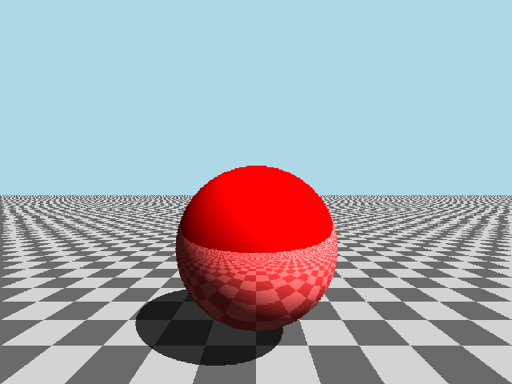
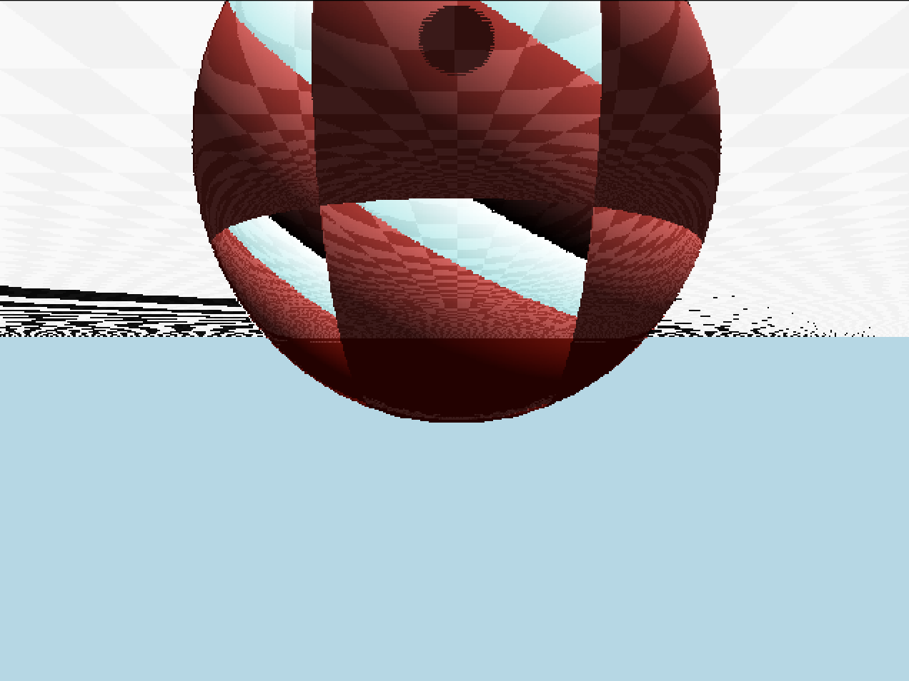
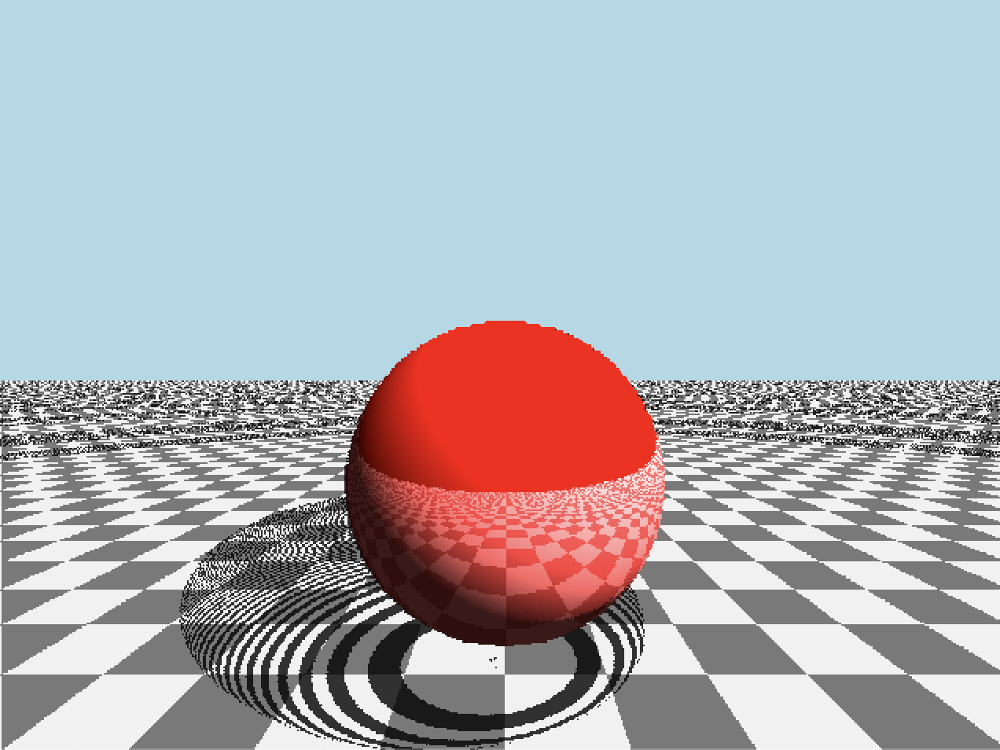

# SV Raytracer

Basic raytracer, supports sphere and infinite plane

Fully pipelined: every heavy op (sqrt, division) is an 18 stage pipeline, one pixel per clock at 25 MHz VGA timing

Simulate with `scripts/test_vga.bash`, then `scripts/check_render.py` sanity checks the frame

Synthesis: `sv2v src/**/*.sv > build/raytracer.v`, then yosys or LibreLane (sky130, config in `build/openlane/`)

some interesting failed renders:

